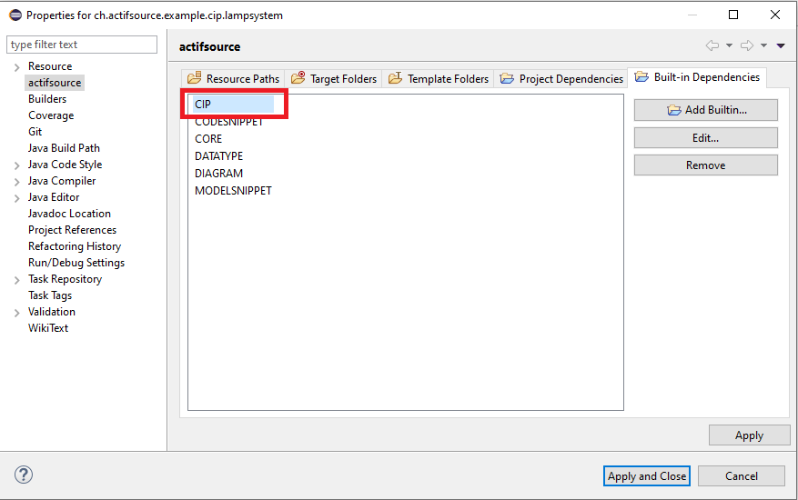

# Codesnippet Model
This project contains different cip examples.  

## Cip Projects
- [Cip LampSystem](https://www.actifsource.com/tutorials/actifsource_cip_tool/cip_statemachine_lamp.html)
- [Cip Unit Test](https://www.actifsource.com/tutorials/actifsource_cip_tool/cip_statemachine_testsuite.html)

## Model Snippet Built-In
Define the model CIP built-in

## Requirements
Actifsource Workbench Enterprise Edition

## License
[http://www.actifsource.com/company/license](http://www.actifsource.com/company/license)
