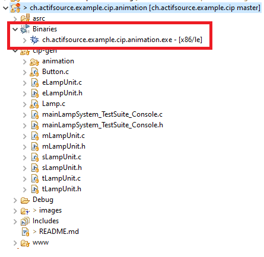
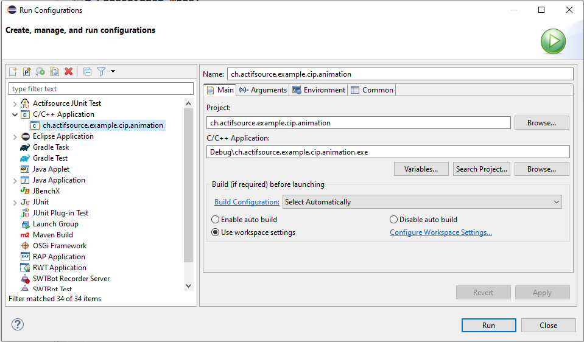
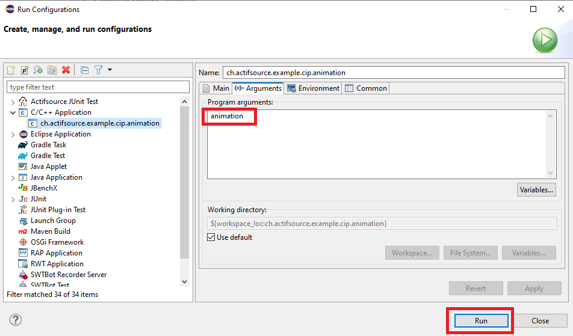
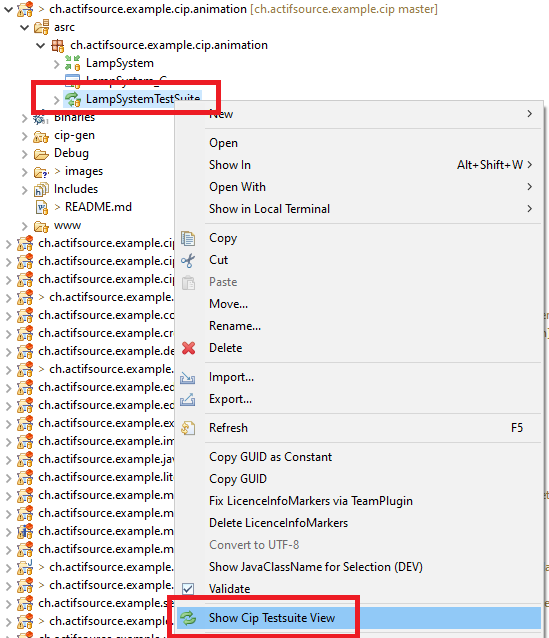
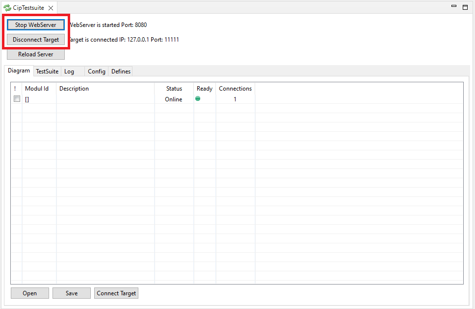
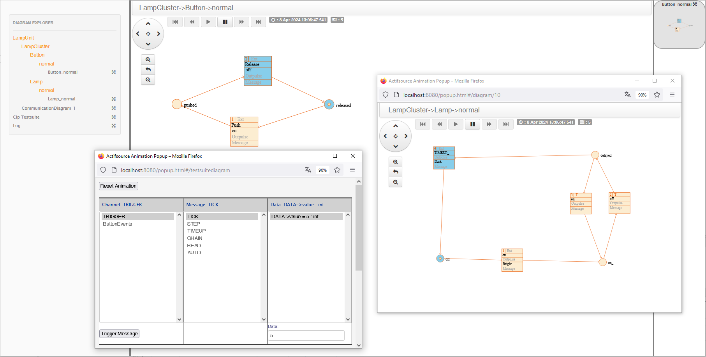

# Cip Animation
This project includes a simple cip animation.  

## Run Example

To run the example, the following steps must be carried out:
1. Cip target must be compiled and executed as 'animation':

2. The server must now be started between the browser and target:

3. Now the browser can be opened with 'http://localhost:8080/':

After continuing the state machine, a 'Reload Server' should be carried out to reload the configuration.  
If the SVG graphics are not updated automatically in the browser, the cache must be deleted in the browser.

## Requirements
Actifsource Workbench Enterprise Edition

## License
[http://www.actifsource.com/company/license](http://www.actifsource.com/company/license)
