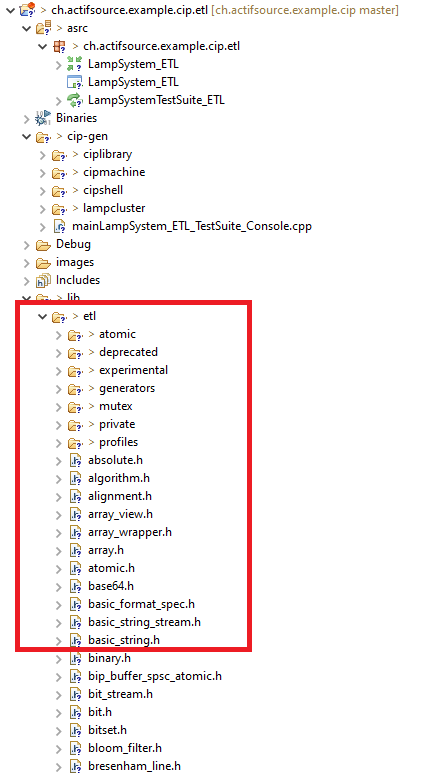

# Cip ETL
This project includes a simple cip model that generates code against the [ETL librari](https://www.etlcpp.com).

## Run Example

To be able to compile the project, the etl library must be downloaded from the [github](https://github.com/ETLCPP/etl) repository.  
The folder [include/etl'](https://github.com/ETLCPP/etl/tree/master/include/etl) must then be copied to this directory 'lib'.

## Requirements
Actifsource Workbench Enterprise Edition

## License
[http://www.actifsource.com/company/license](http://www.actifsource.com/company/license)

[ETL MIT License](https://github.com/ETLCPP/etl?tab=MIT-1-ov-file)
