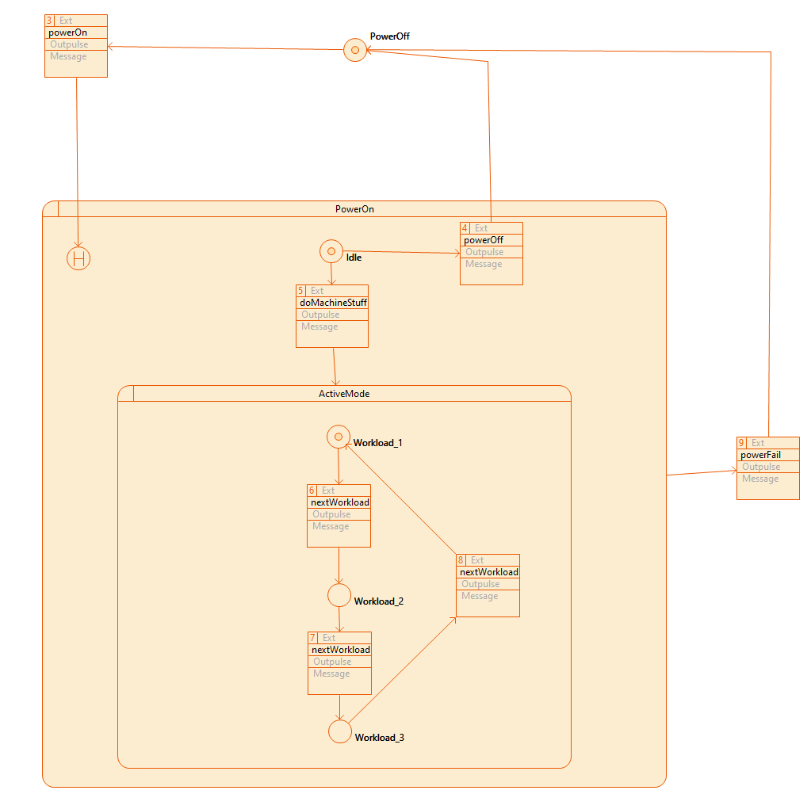
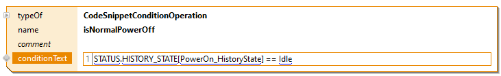
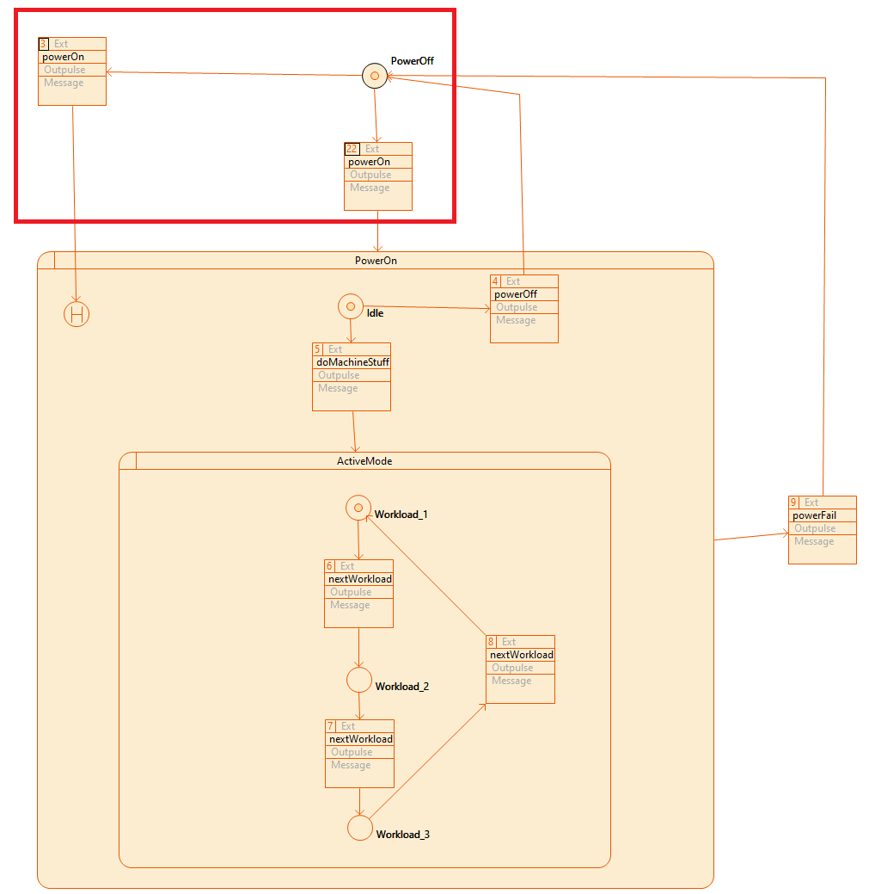
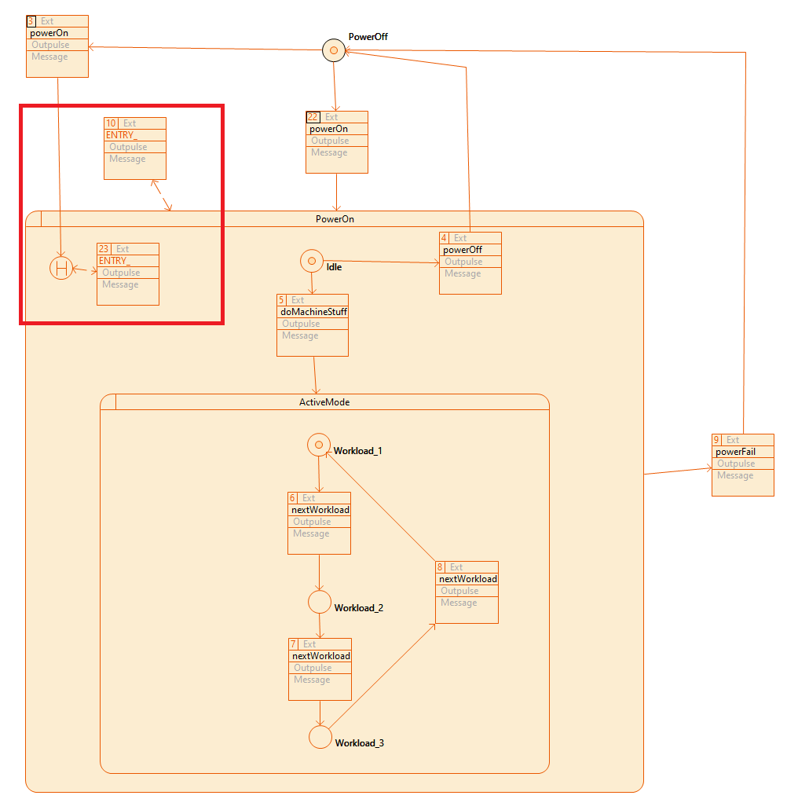
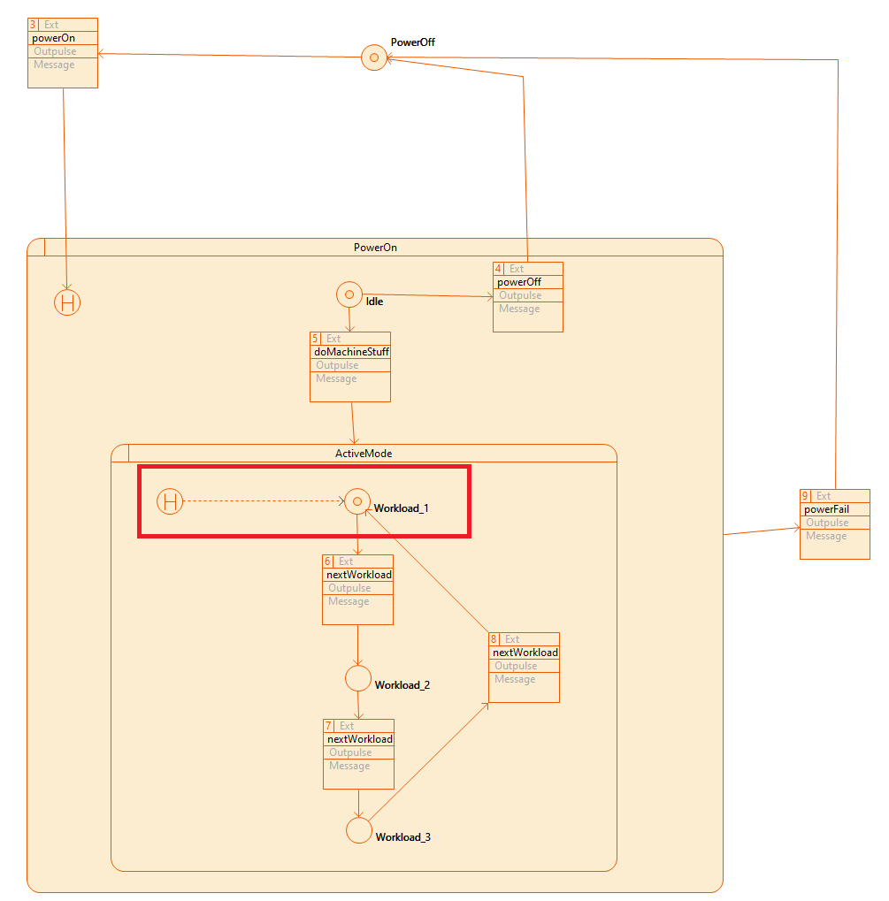

# CIP History State

With this CIP extension, it should be possible to define a Deep History State on each Super State.
The initial state of the history state corresponds to the super state initial state.
The behavior basically corresponds to that of the UML.

Example sequence:
- Workload_2 -> powerFail (Set History State: Workload_2) -> PowerOff -> powerOn -> Workload_2

Of course, a Deep History state could also be defined on the Super State ActiveMode.

The history state value can be accessed to define conditions, for example.

Example sequence:
- PowerOff -> powerOn 22 -> Idle -> powerFail 9 -> PowerOff -> powerOn 22 -> Idle
- PowerOff -> powerOn 22 -> Idle -> doMachineStuff 5 -> powerFail 9 -> PowerOff -> powerOn 3 -> Workload_1

This extension allows the Entry Actions defined on the Super State to be overwritten, can be overwritten.

Example sequence:
- PowerOff -> powerOn 22 -> Entry 10 -> Idle -> powerFail 9 -> PowerOff -> powerOn 22 ->  Entry 10 -> Idle
- PowerOff -> powerOn 22 -> Entry 10 -> Idle -> doMachineStuff 5 -> powerFail 9 -> PowerOff -> powerOn 3 ->  Entry 23 -> Workload_1

This extension with redirect makes it possible to force the behavior of the Shallow History State for specific super states. 

Example sequence:
- Workload_2 -> powerFail (Set History State: Workload_2) -> PowerOff -> powerOn -> Workload_1

## Requirements
Actifsource Workbench Enterprise Edition

## License
[http://www.actifsource.com/company/license](http://www.actifsource.com/company/license)
