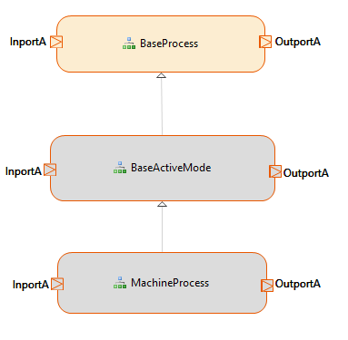
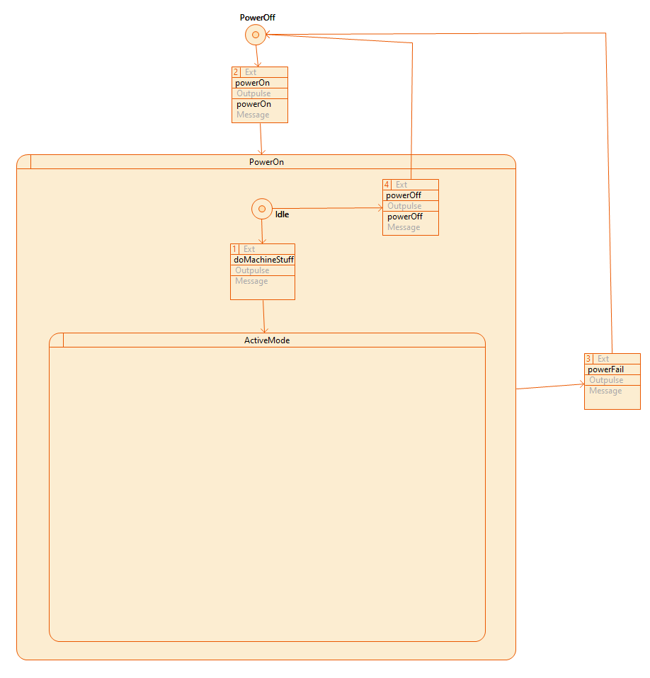
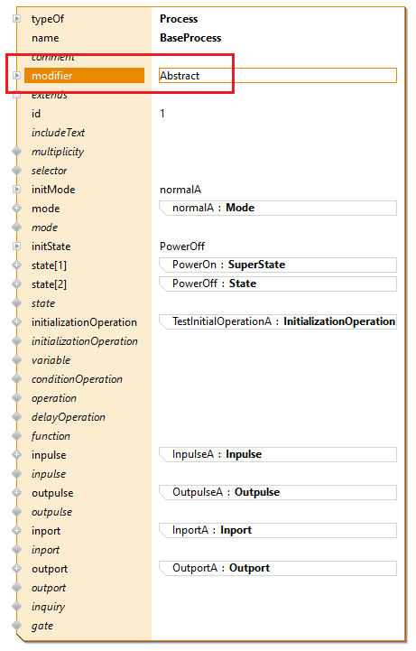
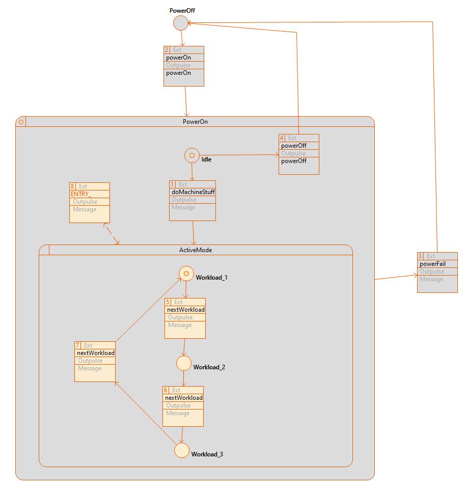
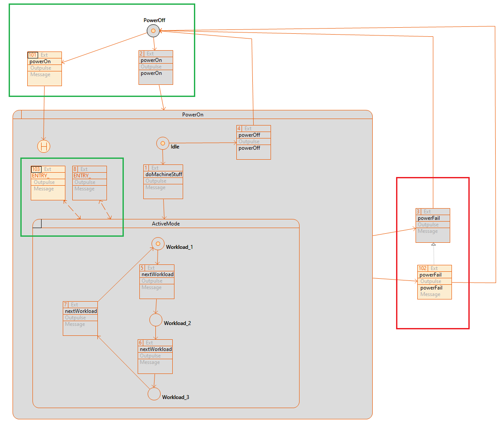

# CIP Statemachine Templates

With this CIP extension, it is possible to inherit processes across multiple hierarchy levels.
Everything that a process defines is inherited by the underlying process and can be extended or overwritten there.

The following example shows the 'BaseProcess' which defines a template state machine in which all CIP features can be used without restriction.

The 'modifier' property can be defined for each process:

- Abstract: This process cannot be used directly in a system, it serves as a template and does not have to be fully defined.
- Final: This process cannot be extended by another process. It must also be fully defined.
- Not defined: This process can extend other processes and can be extended itself. It must also be fully defined.

The 'BaseActiveMode' process now extends the 'BaseProcess' and receives everything that the base process defines.
These definitions can now be extended or overwritten in the 'BaseActiveMode' process.

In addition, (Process 'MachineProcess') existing transitions can be extended (Transition 102) or different transition paths can be added by conditions (Transition 101 or 103).  

## Requirements
Actifsource Workbench Enterprise Edition

## License
[http://www.actifsource.com/company/license](http://www.actifsource.com/company/license)
